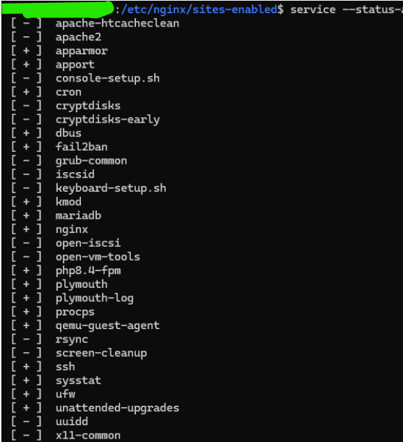
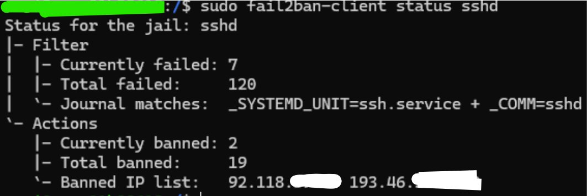
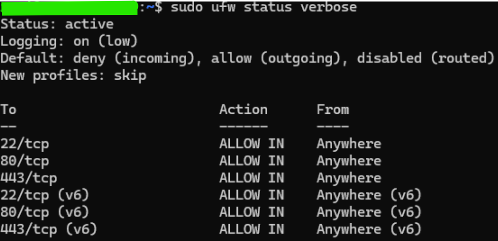
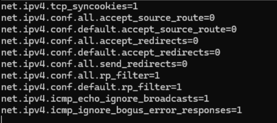
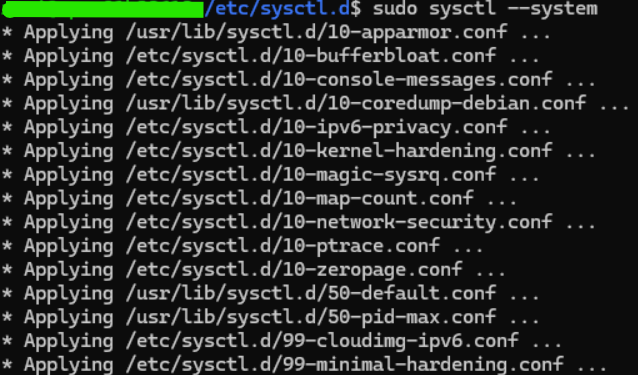
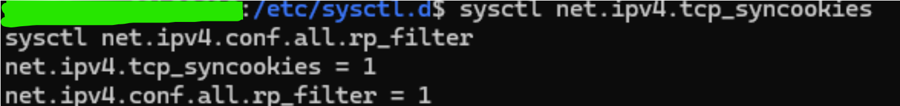

# 🛡️ Phase 1 - System Hardening & Surface Reduction

## 📝 Résumé Global

L'objectif de cette phase est de sécuriser un serveur web **Nginx** en production via une approche progressive.

Cette stratégie repose sur quatre piliers :

- **Audit & Nettoyage** des services inutilisés  
- **Filtrage Réseau** restrictif (UFW)  
- **Protection Anti-Bruteforce** (Fail2ban)  
- **Durcissement du Noyau** (Kernel Hardening via sysctl)  

> [!IMPORTANT]  
> Toutes les actions ont été réalisées **sans interruption de service** afin de garantir la disponibilité des sites hébergés.

---

# 🔍 Section 1 : Analyse des Services & Réduction de la Surface d'Attaque

Un audit a révélé la présence d’**Apache2**, inutilisé et faisant doublon avec Nginx.  
Il a été supprimé afin d’éliminer un vecteur d’attaque potentiel.

## 🔎 Inventaire des services

```bash
service --status-all
```

## 🗑 Suppression du service redondant

```bash
sudo systemctl stop apache2
sudo apt-get purge apache2
```

## 🔐 Sécurisation des accès SSH

- Désactivation de l'accès root direct  
- Utilisation d'un utilisateur dédié avec privilèges `sudo`  

### 📸 Preuve visuelle



---

# 🛡️ Section 2 : Prévention d'Intrusion (UFW & Fail2ban)

## 🔎 Fail2ban – Protection Anti-Bruteforce

Vérification des journaux pour confirmer que la protection SSH est active :

```bash
sudo tail -n 50 /var/log/fail2ban.log
```

### 📸 Logs Fail2ban



---

## 🔥 UFW – Politique Deny by Default

Application d'une politique restrictive :

Seuls les ports essentiels sont autorisés :

- 22 → SSH  
- 80 → HTTP  
- 443 → HTTPS  

### Configuration des règles

```bash
sudo ufw allow ssh
sudo ufw allow 80/tcp
sudo ufw allow 443/tcp
```

### Activation du pare-feu

```bash
sudo ufw enable
```

### 📸 Configuration UFW



---

# ⚙️ Section 3 : Sécurisation du Kernel Linux (sysctl)

Optimisation des paramètres réseau du noyau pour bloquer les attaques de bas niveau.

## 🛡️ Protections Implémentées

- **SYN Cookies** → Protection contre les attaques SYN Flood  
- **Reverse Path Filtering** → Prévention de l’IP Spoofing  
- **Désactivation ICMP Redirects** → Réduction du risque Man-in-the-Middle  

---

## 📁 Configuration Persistante

Fichier utilisé :

```bash
/etc/sysctl.d/99-minimal-hardening.conf
```

### 📸 Fichier de configuration



---

## 🚀 Application sans redémarrage

```bash
sudo sysctl --system
```

### 📸 Application des paramètres



---

# ✅ Section 4 : Vérification Technique Finale

Validation des paramètres critiques :

```bash
sysctl net.ipv4.tcp_syncookies
sysctl net.ipv4.conf.all.rp_filter
```

Les valeurs doivent retourner :

```
1
```

Si c’est le cas, le durcissement est actif.

### 📸 Vérification finale



---

# 🚀 Conclusion

Le VPS dispose désormais :

- D’une surface d’attaque minimale  
- D’un filtrage réseau strict  
- D’une protection anti-bruteforce active  
- D’un noyau Linux renforcé  

Le système est prêt pour la **Phase 2 : Déploiement de la stack d’observabilité**.
