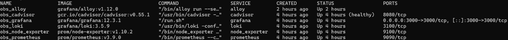
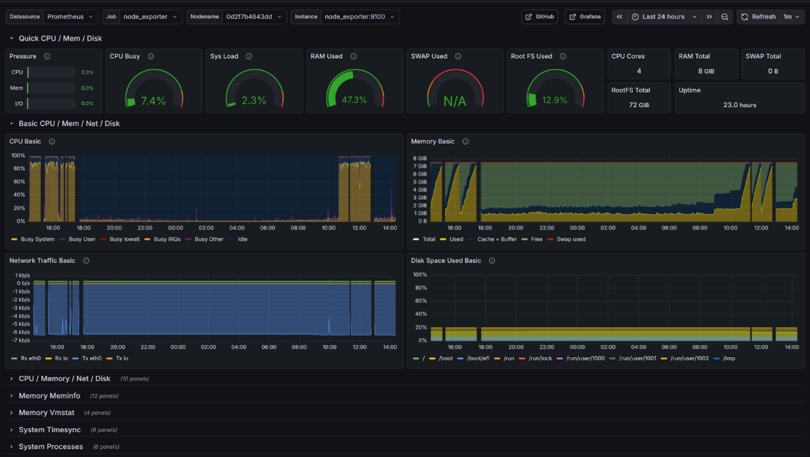
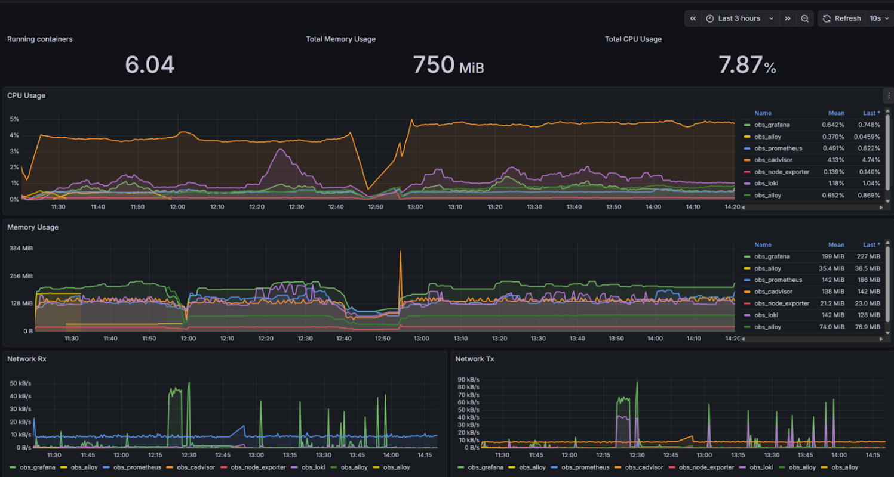
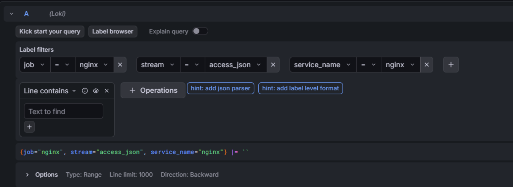
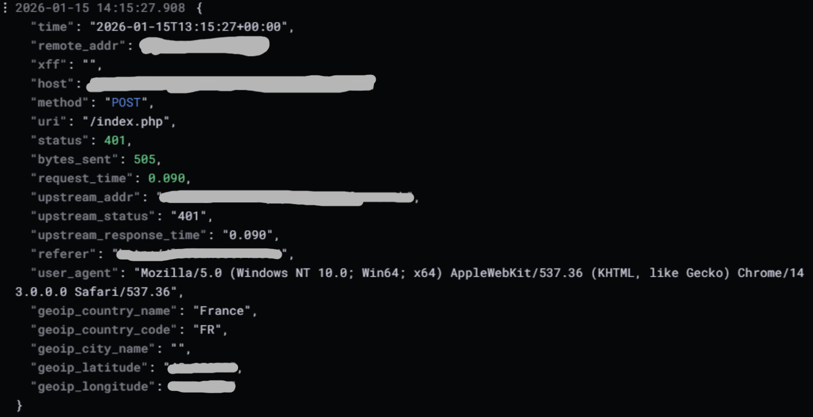
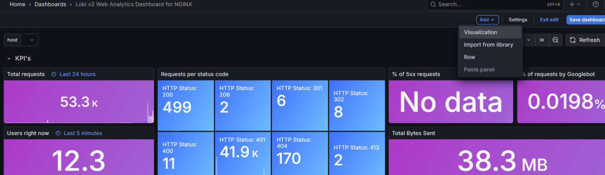
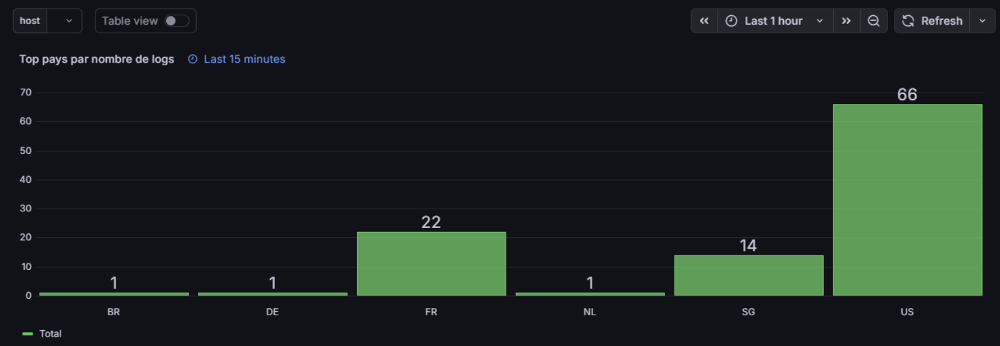
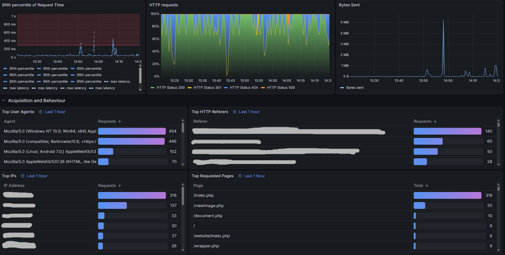

# 📊 Phase 2 - Observability Stack (LGMA)

## 📝 Résumé Global

L’objectif de cette phase est de déployer une stack complète d’observabilité en environnement Docker afin de superviser :

- **Les métriques système**
- **Les métriques conteneurs**
- **Les logs applicatifs**
- **L’analyse GeoIP des requêtes web**

Cette architecture repose sur six composants :

- **Grafana** → Visualisation  
- **Prometheus** → Collecte des métriques  
- **Loki** → Centralisation des logs  
- **Grafana Alloy** → Collecte contrôlée  
- **Node Exporter** → Métriques système  
- **cAdvisor** → Métriques Docker  

> [!IMPORTANT]  
> Les fichiers de configuration complets ne sont pas publiés pour des raisons de sécurité (environnement de production).  
> Seule la méthodologie et les validations sont exposées.

---

# 🔧 Section 1 : Installation Docker (méthode officielle sécurisée)

## 🔄 Mise à jour & dépendances

```bash
sudo apt-get update
sudo apt-get install -y ca-certificates curl gnupg
```

## 🔐 Ajout du keyring Docker

```bash
sudo install -m 0755 -d /etc/apt/keyrings
curl -fsSL https://download.docker.com/linux/ubuntu/gpg | \
sudo gpg --dearmor -o /etc/apt/keyrings/docker.gpg
sudo chmod a+r /etc/apt/keyrings/docker.gpg
```

## 📦 Ajout du dépôt Docker

```bash
echo \
"deb [arch=$(dpkg --print-architecture) signed-by=/etc/apt/keyrings/docker.gpg] \
https://download.docker.com/linux/ubuntu \
$(. /etc/os-release && echo $UBUNTU_CODENAME) stable" | \
sudo tee /etc/apt/sources.list.d/docker.list > /dev/null
```

## 🐳 Installation Docker Engine + Compose

```bash
sudo apt-get update
sudo apt-get install -y \
docker-ce docker-ce-cli containerd.io \
docker-buildx-plugin docker-compose-plugin
```

---

# 📂 Section 2 : Préparation de l’Environnement Observability

Création d’une arborescence dédiée :

```bash
sudo mkdir -p /opt/observability/{grafana/provisioning/datasources,prometheus,loki,alloy,data}
```

## 📁 Fichiers de configuration créés

Les fichiers suivants ont été configurés :

```bash
/opt/observability/docker-compose.yml
/opt/observability/prometheus/prometheus.yml
/opt/observability/loki/loki.yml
/opt/observability/grafana/provisioning/datasources/datasources.yml
/opt/observability/alloy/config.alloy
```

Ces fichiers assurent :

- Orchestration des services  
- Scraping des métriques  
- Stockage persistant des logs  
- Provisionnement automatique des datasources  
- Collecte contrôlée des journaux  

---

# 🐙 Section 3 : Orchestration Docker Compose

Services déployés :

- grafana  
- prometheus  
- loki  
- alloy  
- node_exporter  
- cadvisor  

---

# 🚀 Section 4 : Démarrage & Validation

## ▶️ Lancement de la stack

```bash
cd /opt/observability
sudo docker compose up -d
```

## 🔍 Vérification des conteneurs

```bash
sudo docker compose ps
```

### 📸 Conteneurs opérationnels



Les six conteneurs sont confirmés **Up** et opérationnels.

---

# 📈 Section 5 : Monitoring Système & Conteneurs

## 🖥️ Dashboard Système (Node Exporter – ID 1860)

Supervision :

- CPU  
- RAM  
- Disque  
- Réseau  



---

## 🐳 Dashboard Docker (cAdvisor)

Suivi de l'utilisation CPU et mémoire par conteneur.



> ℹ️ La majorité des panels de ces dashboards ont été repris, adaptés et optimisés manuellement.  
> Ils restent entièrement modifiables afin d’être ajustés selon les besoins métier ou techniques.

---

# 📜 Section 6 : Centralisation des Logs NGINX (Loki)

## 🔎 Exploration des logs dans Grafana

Requête construite via labels :

```bash
{job="nginx", stream="access_json", service_name="nginx"}
```



---

## 🌍 Logs JSON enrichis GeoIP

Les logs sont enrichis côté NGINX avec :

- geoip_country_name  
- geoip_country_code  
- méthode HTTP  
- code statut  



---

# 📊 Section 7 : Exemple de Création d’un Panel GeoIP

La création suivante illustre **un exemple rapide de création de panel personnalisé** dans Grafana.

## ➕ Ajout d’un nouveau panel

Menu Add → Visualization



---

## 🧠 Requête LogQL utilisée

```bash
sum by (geoip_country_code) (
  count_over_time(
    {job="nginx", stream="access_json"}
    | json
    | __error__=""
    [$__interval]
  )
)
```


## 📈 Résultat : Dashboard GeoIP

Panel de type Bar Chart affichant le volume de logs par pays.



> ⚙️ Comme pour les dashboards précédents, les panels sont personnalisables et ajustables afin d’optimiser la lisibilité et la pertinence opérationnelle.

---

# ✅ Section 8 : Vérification Finale de la Chaîne d’Observabilité

Validation complète :

NGINX → Alloy → Loki → Grafana  
Node Exporter / cAdvisor → Prometheus → Grafana  

Vue consolidée finale des dashboards :



---

# 🚀 Conclusion

La stack d’observabilité est désormais :

- Fonctionnelle (metrics + logs)  
- Corrélée (logs + métriques + GeoIP)  
- Sécurisée (pas d’exposition publique Grafana)  
- Persistante (volumes Docker)  
- Reproductible (structure standardisée via fichiers YAML)  

Cette infrastructure constitue une base solide pour les futures phases :

- Alerting  
- Corrélation d’événements  
- Détection d’anomalies  
- Approche Blue Team avancée  
