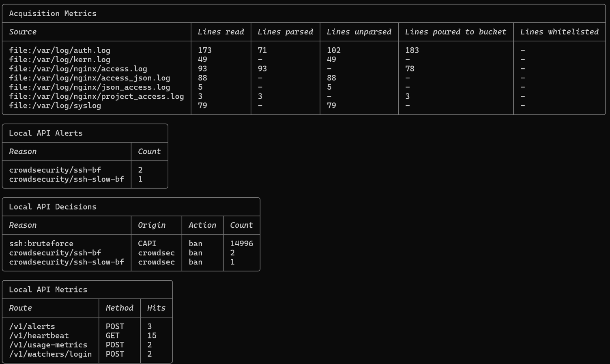
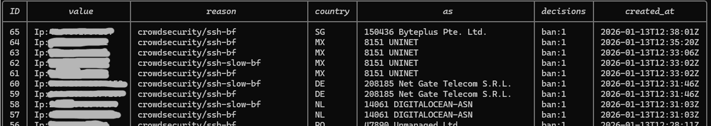
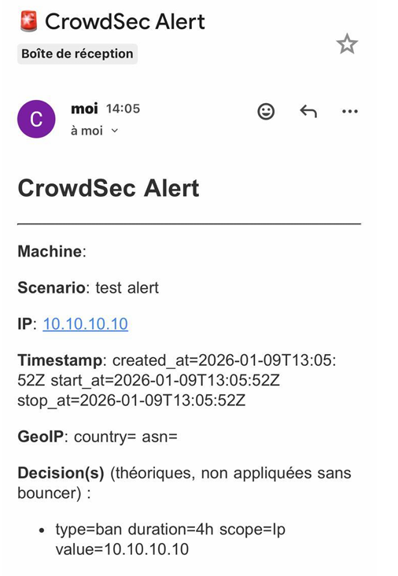
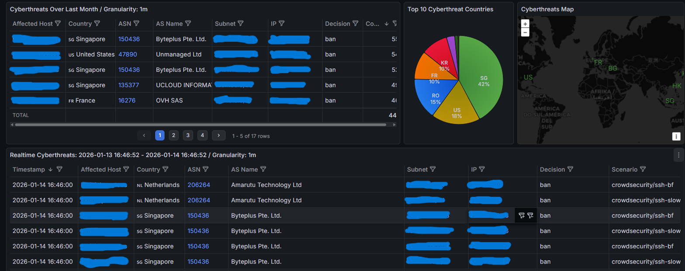
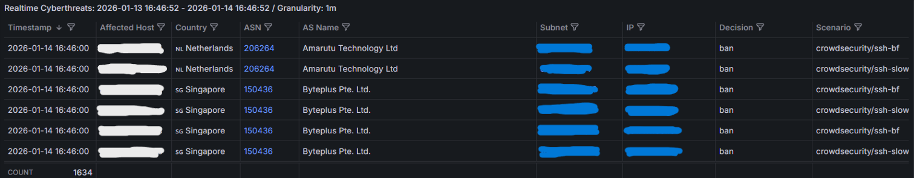
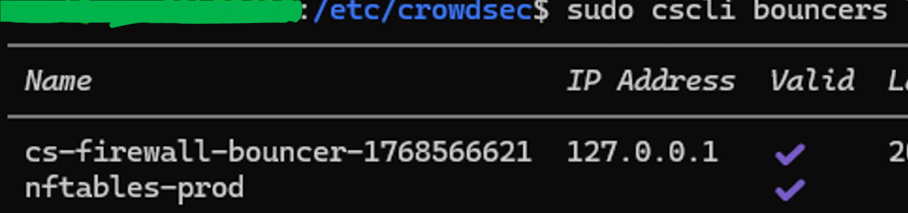
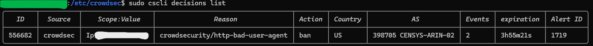
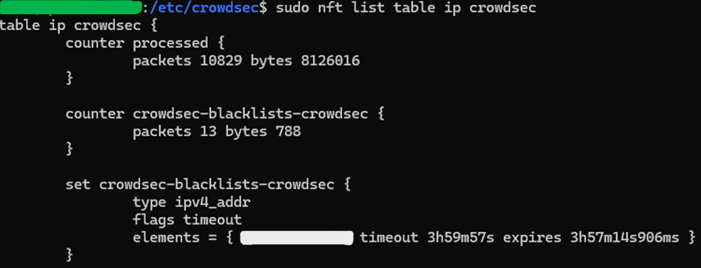

# 🛡️ Phase 3 – HIPS with CrowdSec (Behavioral Detection & Active Remediation)

## 📝 Executive Summary

After:

- ✔️ Attack surface reduction (Phase 1)
- ✔️ Full LGMA observability stack (Phase 2)

This phase introduces a **Host Intrusion Prevention System (HIPS)** powered by CrowdSec.

Objectives:

- Real-time behavioral detection (SSH & NGINX)
- GeoIP enrichment (Country / ASN)
- Instant alerting (SMTP)
- Metrics centralization via VictoriaMetrics
- Automated remediation via nftables (kernel-level)
- Zero service interruption

The transition was performed progressively:

```
Observation ➜ Validation ➜ Remediation Activation ➜ Fail2ban Removal
```

---

# ⚙️ Section 0 — CrowdSec Installation & Prerequisites

## 📦 Install CrowdSec

```bash
curl -s https://packagecloud.io/install/repositories/crowdsec/crowdsec/script.deb.sh | sudo bash
sudo apt-get install crowdsec
```

## 🔌 Install the nftables Bouncer

```bash
sudo apt-get install crowdsec-firewall-bouncer-nftables
```

## 📋 Verify Installation

```bash
sudo systemctl status crowdsec
sudo cscli version
```

## 🎯 Collections Installed

CrowdSec uses **collections** — bundles of parsers and scenarios for specific services.

```bash
sudo cscli collections install crowdsecurity/nginx
sudo cscli collections install crowdsecurity/sshd
```

Collections installed:

| Collection | Purpose |
|---|---|
| `crowdsecurity/nginx` | HTTP log parsing + web attack scenarios |
| `crowdsecurity/sshd` | SSH log parsing + brute-force scenarios |

## 🔍 Verify Active Scenarios

```bash
sudo cscli scenarios list
```

Key scenarios active:

- `crowdsecurity/ssh-bf` — SSH fast brute-force
- `crowdsecurity/ssh-slow-bf` — SSH slow brute-force
- `crowdsecurity/http-probing` — HTTP reconnaissance
- `crowdsecurity/http-bad-user-agent` — Malicious user agents

---

# 🔎 Section 1 — Behavioral Detection (Observation Mode)

## 🎯 Objective

Validate the engine's ability to:

- Properly parse logs
- Trigger scenarios (ssh-bf, ssh-slow-bf, http-probing…)
- Generate enriched alerts
- Without enabling immediate banning

---

## 📥 Log Ingestion Validation

Verification command:

```bash
sudo cscli metrics
```



### 🔎 Analysis

This view confirms:

- Active ingestion of SSH & NGINX logs
- Functional parsers
- Buckets properly populated
- No critical parsing errors

👉 The engine correctly processes live production traffic.

---

# 🚨 Section 2 — Alerts & GeoIP Enrichment

## 📊 Reviewing Detected Alerts

```bash
sudo cscli alerts list
```



### Enriched Data Includes:

- Source IP
- Country of origin
- ASN (Autonomous System Number)
- Triggered scenario (e.g., ssh-bf)

👉 This enrichment enables immediate SOC-level analysis.

---

## 📧 SMTP Alerting (Mobile Monitoring)

Notification configured via Gmail SMTP (application password required).

Test command:

```bash
sudo cscli notifications test email_default
```



Each alert contains:

- Banned IP address
- Triggered scenario
- Geolocation data
- Precise timestamp

🎯 Enables remote monitoring without direct SSH access.

---

# 📊 Section 3 — SOC Visualization (Grafana + VictoriaMetrics)

## 🏗️ CrowdSec Metrics Pipeline

CrowdSec produces structured alert data (NDJSON format) that is routed through a dedicated observability pipeline:

```
CrowdSec (NDJSON alerts)
        │
        ▼
  Grafana Alloy
  (dedicated pipeline)
        │
        ▼
  VictoriaMetrics
  (metrics storage — separated from Prometheus)
        │
        ▼
    Grafana
  (SOC dashboards)
```

**Why VictoriaMetrics and not Prometheus?**

CrowdSec generates high-cardinality metrics (one label set per IP/scenario/country combination). VictoriaMetrics is optimized for this workload and avoids bloating the main Prometheus instance used for system metrics.

---

## 🌍 Global Threat Overview Dashboard



This dashboard provides:

- Consolidated threat overview
- World threat map (Geomap)
- 24-hour attack volume
- Most active ASNs

---

## 🔐 SSH Brute Force Focus



Analysis includes:

- Time-based spikes on port 22
- Fast vs slow brute-force identification
- Correlation with time periods

👉 Critical tool for remediation decision-making.

---

# 🛡️ Section 4 — Remediation Activation (nftables Bouncer)

After validation in observation mode, the firewall bouncer was activated.

---

## 🧾 Strategic Allowlist Creation

Before activation:

- Administrator IPs
- VPS provider IPs
- External monitoring IPs

```bash
sudo cscli allowlists create admin_ips
sudo cscli allowlists add admin_ips "X.X.X.X"
```

> [!IMPORTANT]
> Creating allowlists **before** activating the bouncer is critical.
> Failure to do so risks locking out the administrator from the production server.

---

## 🔑 Bouncer Creation

```bash
sudo cscli bouncers add nftables-prod
```

---

## ✅ Bouncer Registration Verification

```bash
sudo cscli bouncers list
```



Expected status:

```
Valid
```

👉 The engine is now authorized to enforce decisions.

---

## 🚫 Active Decisions

```bash
sudo cscli decisions list
```



Observed data:

- Banned IP addresses
- Triggering scenario
- Remaining ban duration
- Action type: ban

---

## ⚙️ Kernel-Level Injection (nftables)

```bash
sudo nft list table ip crowdsec
```



Banned IPs appear directly inside nftables sets.

🎯 Enforcement characteristics:

- Kernel-level blocking
- No intermediate service
- Minimal CPU impact

High-performance prevention.

---

# ⚠️ Real Incident — Managing Rule Volume

An excessive number of dynamic decisions temporarily:

- Increased nftables rule complexity
- Caused firewall overhead

### Remediation applied:

```bash
sudo cscli decisions delete --all
```

Effects:

- Significant reduction of dynamic rules
- Firewall stabilization
- Continued detection capability

👉 Production-oriented pragmatic decision.

---

# 🔄 Final Transition — Fail2ban Removal

Once remediation was validated and CrowdSec confirmed stable in production:

```bash
sudo systemctl stop fail2ban
sudo systemctl disable fail2ban
sudo apt remove --purge fail2ban
```

### Why replace Fail2ban?

| Feature | Fail2ban | CrowdSec |
|---|---|---|
| Detection method | Regex-based | Behavioral scenarios |
| GeoIP enrichment | ❌ | ✔️ Country + ASN |
| Observability integration | Limited | Full (VictoriaMetrics + Grafana) |
| Shared threat intelligence | ❌ | ✔️ Community blocklist |
| Rule management | Per-service config files | Collections + hub |

---

# ✅ Conclusion

The VPS now benefits from:

- ✔️ Behavioral host intrusion prevention
- ✔️ Real-time enriched alerts (SMTP)
- ✔️ SOC-level visualization (Grafana + VictoriaMetrics)
- ✔️ Automated kernel-level blocking (nftables)
- ✔️ Scalable and maintainable architecture

The Host IPS layer is fully operational.

---

➡️ **Next: [Phase 4 – NIPS with Suricata](../phase-4-nips-suricata/network-protection.md)**
