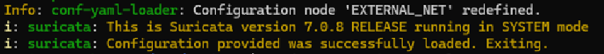
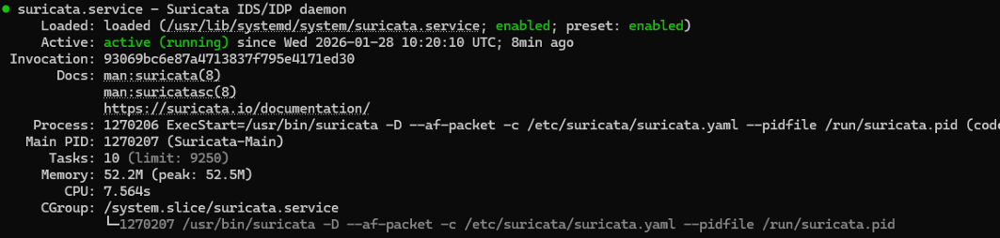
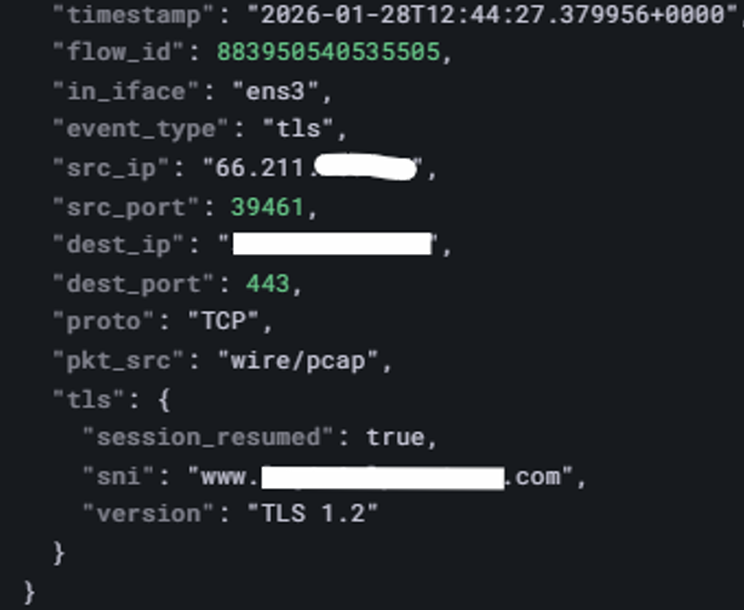
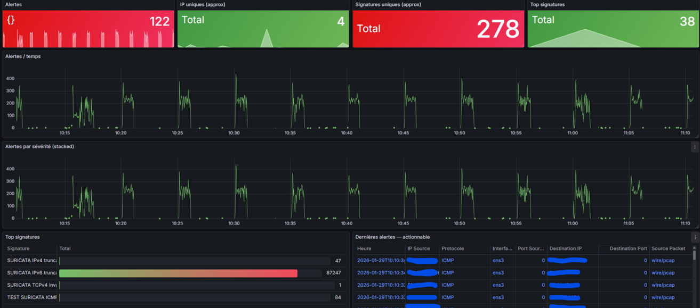
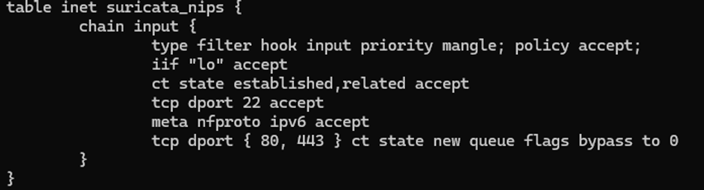
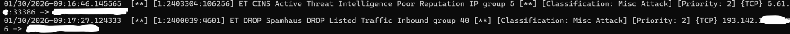
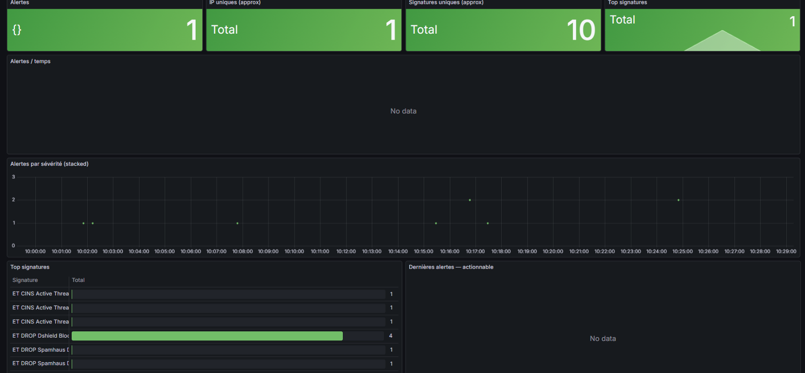
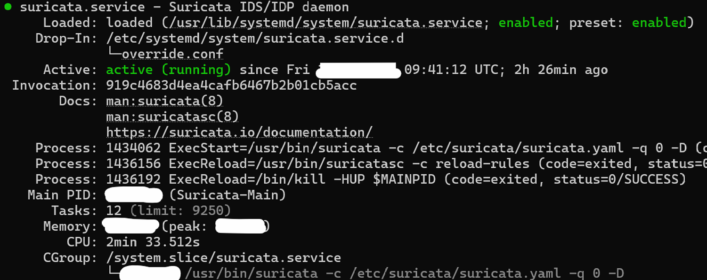

# 🔥 Phase 4 – Network IPS with Suricata (IDS ➜ Inline NIPS)

## 📝 Executive Summary

After implementing:

- Host-level behavioral prevention (CrowdSec)
- Full observability stack (LGMA)

This phase introduces a **Network Intrusion Prevention System (NIPS)** using Suricata in inline mode.

Deployment strategy:

1. Deploy in IDS mode (detection only)
2. Validate logging & visibility
3. Benchmark traffic baseline
4. Switch to NFQUEUE inline mode
5. Enable controlled DROP rules
6. Implement zero-downtime rule updates

Objective:

- Block real network scans (Nmap, NULL, XMAS)
- Avoid impacting SSH / HTTP / HTTPS / IPv6
- Maintain full observability
- Guarantee safe rollback

---

# 🔎 Section 1 — Suricata IDS (Detection Mode)

## Configuration Validation

Before starting the service, configuration integrity was validated:

```bash
sudo suricata -T
```



✔ Configuration successfully loaded  
✔ No fatal errors  
✔ Production-safe validation  

This ensures Suricata starts with a clean configuration.

---

## Service Startup

```bash
sudo systemctl start suricata
sudo systemctl status suricata
```



✔ Suricata running under systemd  
✔ No crash loops  
✔ Proper PID management  

IDS mode is now active.

---

# 📡 Section 2 — Traffic Inspection & Log Integration

Suricata inspects traffic directly on the public interface.

Example TLS event captured from `eve.json`:



Observed fields:

- Source IP
- Destination IP
- TLS version
- SNI hostname
- Direct capture from interface

✔ Deep Packet Inspection confirmed  
✔ Full visibility of encrypted session metadata  

Logs are forwarded to Loki via Alloy for centralized analysis.

---

# 📊 Section 3 — IDS Baseline (Before Inline)

Initial Grafana dashboard (IDS mode):



Observations:

- High alert volume
- Noise from non-exposed ports
- Recon attempts fully visible

✔ Detection working correctly  
✔ Useful for baseline benchmarking  

---

# 🔥 Section 4 — Transition to NIPS (Inline Mode)

## Architecture Principle

- UFW → Port exposure
- nftables → Traffic selection
- Suricata → Behavioral decision engine (DROP)

Suricata does **not** inspect everything — only selected traffic via NFQUEUE.

---

## nftables Traffic Redirection

```bash
sudo nft list table inet suricata_nips
```



Key elements:

- Hook: input
- Priority: -150
- Established connections accepted
- SSH explicitly allowed
- IPv6 excluded
- HTTP/HTTPS (IPv4, NEW state) sent to NFQUEUE

✔ Minimal attack surface  
✔ Performance optimized  
✔ Explicit whitelist before inspection  

---

## Local DROP Rules (Production-Safe)

Only high-confidence signatures enabled:

- TCP NULL scan
- TCP XMAS scan

Goal:

- Zero false positives
- Immediate scan blocking
- No impact on legitimate traffic

---

# 🚫 Section 5 — Effective DROP Verification

Real-time log monitoring confirms DROP execution:



✔ DROP action visible in logs  
✔ Not just alert — actual packet blocking  
✔ Inline enforcement active  

Suricata now operates as a **true Network IPS**.

---

# 📉 Section 6 — Telemetry Impact (After NIPS)

Grafana dashboard after inline activation:



Observed improvements:

- Noise dramatically reduced
- Non-exposed port scans dropped before logging
- Cleaner telemetry signal
- Reduced log ingestion load

✔ Better readability  
✔ Lower system overhead  
✔ Security signal becomes actionable  

This behavior is expected and desired in production.

---

# ⚙️ Section 7 — Production Hardening (Service Mode)

Suricata permanently configured in NFQUEUE mode.

Verification:

```bash
ps aux | grep suricata
```



Confirmed:

- Single Suricata process
- Running in nfqueue mode
- Managed by systemd
- Integrated with nftables

✔ Automatic startup  
✔ Inline enforcement persistent  
✔ No manual debug dependency  

---

# 🔄 Section 8 — Zero-Downtime Rule Updates

Production-safe update strategy:

1. Download new rules
2. Validate with `suricata -T`
3. Apply `systemctl reload suricata`
4. Preserve old rules on failure

Why reload and not restart?

In inline (Fail-Closed) mode:

- A restart immediately drops live traffic.
- Reload keeps NFQUEUE active.

✔ Pre-validation before deployment  
✔ Hot reload  
✔ No traffic interruption  

---

# ✅ Final Architecture State

The VPS now includes:

- ✔ Host-level IPS (CrowdSec)
- ✔ Network-level IPS (Suricata inline NFQUEUE)
- ✔ Kernel-level enforcement (nftables)
- ✔ Zero-downtime rule updates
- ✔ Full observability via Loki & Grafana
- ✔ Controlled minimal DROP rules
- ✔ Production-safe rollback capability

Suricata is used as a **targeted decision engine**, not as a generic firewall.

---

# 🚀 Ready for Phase 5 — Threat Hunting & MITRE Mapping
