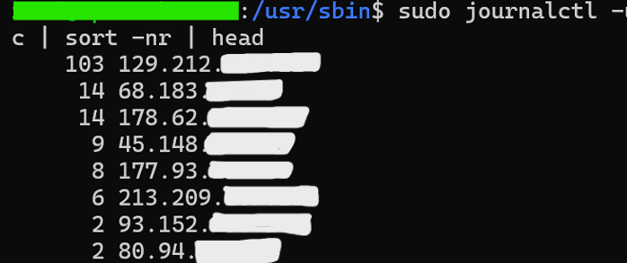
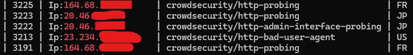
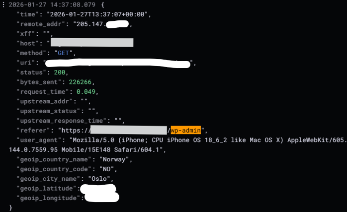
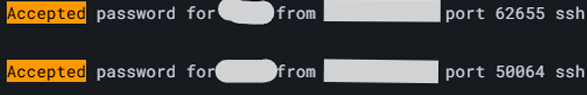
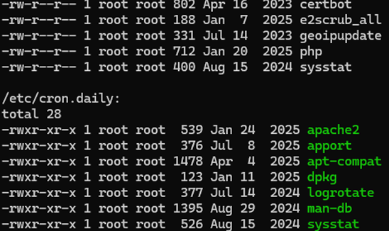

# 🧠 Phase 5 – Threat Hunting & Validation MITRE ATT&CK

## 📝 Résumé Exécutif

Cette phase présente un **exercice structuré de threat hunting réalisé sur un serveur Linux en production**.

### Caractéristiques de l’approche :

- Méthodologie basée sur des hypothèses  
- Investigation non intrusive  
- Analyse de logs réels en environnement de production  
- Mapping avec le framework MITRE ATT&CK  
- Corrélation avec les couches de sécurité déployées (CrowdSec + Suricata)  

### Objectifs

- Valider l’exposition réelle du serveur  
- Confirmer l’efficacité des mécanismes de défense  
- Identifier d’éventuels indicateurs de compromission (IOC)  
- Évaluer la posture de sécurité globale  

Toutes les données ont été anonymisées.

---

# 🔎 Scénario 1 — Tentatives externes de brute force SSH

## 🎯 Hypothèse

Un attaquant externe peut tenter des authentifications SSH répétées (brute force ou énumération de comptes).

## 🧭 Mapping MITRE ATT&CK

- **Tactique :** Initial Access  
- **[T1110.001 – Brute Force: SSH ↗](https://attack.mitre.org/techniques/T1110/001/)**  
- **[T1087 – Account Discovery ↗](https://attack.mitre.org/techniques/T1087/)**  

## 🔍 Investigation (Analyse CLI)

```bash
sudo journalctl -u ssh --since today | grep -E "Failed password" | head
```

Identification des IP les plus actives :

```bash
sudo journalctl -u ssh --since today \
| grep -E "Failed password|Invalid user" \
| awk '{for(i=1;i<=NF;i++) if($i=="from") print $(i+1)}' \
| sort | uniq -c | sort -nr | head
```



### Constatations

- Multiples tentatives d’échec d’authentification SSH  
- Hiérarchisation des IP les plus actives  
- Schémas typiques de brute force et d’énumération  

## 🛡 Corrélation Défensive

```bash
sudo cscli decisions list
```



CrowdSec a automatiquement banni les adresses IP les plus agressives.

### Conclusion

✔ Hypothèse confirmée  
✔ Exposition SSH réelle observée  
✔ Les mécanismes de défense réduisent le risque  

---

# 🌐 Scénario 2 — Activité de reconnaissance Web

## 🎯 Hypothèse

Un attaquant peut effectuer une reconnaissance sur les services NGINX exposés afin d’identifier des endpoints sensibles ou des mauvaises configurations.

## 🧭 Mapping MITRE ATT&CK

- **[T1595.001 – Active Scanning: Web ↗](https://attack.mitre.org/techniques/T1595/001/)**  
- **[T1046 – Network Service Discovery ↗](https://attack.mitre.org/techniques/T1046/)**  
- **[T1083 – File and Directory Discovery ↗](https://attack.mitre.org/techniques/T1083/)**  

## 🔍 Investigation (Logs NGINX)

```bash
grep -E "wp-admin|\.git|\.env|phpinfo|server-status|\.bak|\.old" /var/log/nginx/access.log
```



### Constatations

- Tentatives automatisées d’accès à `.git`, `.env`, `wp-admin`  
- Majorité des requêtes retournent HTTP 404  
- Aucune exploitation confirmée  

### Conclusion

✔ Activité de reconnaissance confirmée  
✔ Aucun impact détecté  
✔ Niveau de risque évalué comme faible  

---

# 🔐 Scénario 3 — Vérification d’accès SSH réussi

## 🎯 Hypothèse

Un attaquant aurait pu réussir une authentification SSH.

## 🔍 Investigation (Grafana / Loki)

```
{job="system", stream="auth"} |= "Accepted"
```



### Constatations

- Connexions administrateur légitimes uniquement  
- Aucune source suspecte  
- Aucun comportement anormal post-authentification  

### Conclusion

❌ Hypothèse non confirmée  
✔ Aucune preuve de compromission  

L’absence de détection constitue un résultat valide en threat hunting.

---

# 🧑‍💻 Scénario 4 — Tentative d’escalade de privilèges (sudo)

## 🎯 Hypothèse

Un utilisateur pourrait tenter une escalade de privilèges via une utilisation abusive de sudo.

## 🧭 Mapping MITRE ATT&CK

- **[T1548 – Abuse Elevation Control Mechanism ↗](https://attack.mitre.org/techniques/T1548/)**  
- **[T1068 – Exploitation for Privilege Escalation ↗](https://attack.mitre.org/techniques/T1068/)**  

## 🔍 Investigation

```
{job="system", stream="auth"} |= "sudo"
```

```
{job="system"} |~ "permission denied|access denied"
```

### Constatations

- Utilisation sudo légitime uniquement  
- Aucun échec suspect  
- Aucun comportement anormal d’élévation  

### Conclusion

❌ Hypothèse non confirmée  
✔ Aucune tentative d’escalade détectée  

---

# 🕒 Scénario 5 — Mécanismes de persistance (Cron / Comptes)

## 🎯 Hypothèse

Un attaquant pourrait mettre en place un mécanisme de persistance via :

- Modification de tâches cron  
- Création de comptes  
- Manipulation d’utilisateurs existants  

## 🧭 Mapping MITRE ATT&CK

- **[T1053.003 – Scheduled Task/Job: Cron ↗](https://attack.mitre.org/techniques/T1053/003/)**  
- **[T1136 – Create Account ↗](https://attack.mitre.org/techniques/T1136/)**  
- **[T1098 – Account Manipulation ↗](https://attack.mitre.org/techniques/T1098/)**  

## 🔍 Investigation

```bash
ls -l /etc/cron.*
```

```bash
getent passwd | cut -d ":" -f 1
```



### Constatations

- Tâches cron standards uniquement  
- Aucun compte suspect créé  
- Aucun mécanisme de persistance identifié  

### Conclusion

❌ Hypothèse non confirmée  
✔ Aucune persistance détectée  

---

# 📊 Évaluation Globale de la Sécurité

### Observé

- Tentatives opportunistes de brute force SSH  
- Activité de reconnaissance Web automatisée  

### Non observé

- Compromission réussie  
- Escalade de privilèges  
- Mécanisme de persistance  

### Impact des mécanismes de défense

- CrowdSec limite efficacement les attaques opportunistes  
- Suricata en mode NIPS réduit le bruit de reconnaissance  
- La stratégie de défense en profondeur est validée  

---

# 🏁 Conclusion Finale

L’exercice de threat hunting confirme :

- Une exposition réelle à des attaques opportunistes  
- Aucune preuve de compromission  
- Des couches défensives fonctionnelles  
- Une posture de sécurité validée par une analyse méthodique  

L’environnement présente une architecture de sécurité contrôlée, surveillée et stratifiée.

---

# 🚀 Fin de la Phase 5 — Validation de la Posture de Sécurité Complète
